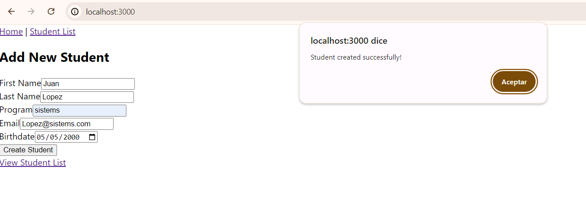
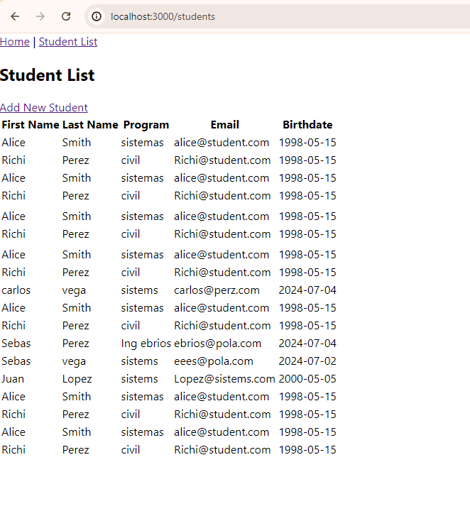
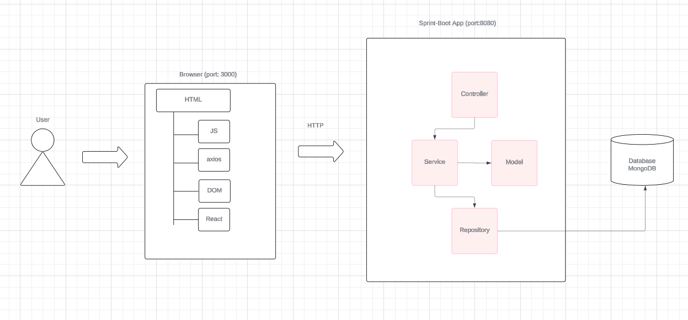

# ListStudentsMongo

The student registration project consisting of two applications: one acts as a frontend and the other as a backend (API) built with Spring Boot. The backend has two endpoints: one (GET) returns a list of registered students and the other (POST) to add students. On the other hand, the frontend is developed in React JS, which graphically represents a web page that has a form to add students, a tab to view the list of students.

### Features
+ **Add students**: You can see the list of students registered in the database.
+ **View list students**: You can add students to the database.


## Starting

In order to use the project on your system, you can access the following link and download a compressed file of it.

[Repository](https://github.com/Richi025/ListStudentsMongo.git) 

You can also clone the file using the following command.

```
git clone https://github.com/Richi025/ListStudentsMongo.git   
```

### Previous requirements

It is necessary to have "**Maven**", "**Java**", "**Node.js**", **"Mongodb"** installed, preferably in their latest versions.

#### Maven
```
Download Maven at http://maven.apache.org/download.html 

Follow the instructions at http://maven.apache.org/download.html#Installation
```
#### Java

```
Download Java at https://www.java.com/es/download/ie_manual.jsp
```

#### Node.js

```
Download Node.js at https://nodejs.org/en
```

#### MongoDB

```
Download MondoDB at https://www.mongodb.com/try/download/community 
```


### Installing

Once you have the cloned project in your repository. Follow the steps below to launch the program successfully.

#### Run BackEnd Spring-boot

1. Open a terminal and enter the folder where I clone the repository and enter the back folder.

2. Use the following command to compile and clean the target directory.
    ```
    mvn clean compile
    ```
3. Now use the following command to package the project as a JAR file.

    ```
    mvn package
    ```

4. Now you can run the project using the following command.

    ```
    mvn spring-boot:run

    Now the server is running.
    ```

5. If when installing Mongodb you left the option to always run the service activated, then you must open the console and run the service with the following command.

    ```
    Mongod
    ```

#### Run FrontEnd React Js

1. Open a terminal and enter the folder where I clone the repository and enter the front folder.

2. Use the following command to install dependencies
    ```
    npm install
    ```
3. Now use the following command start proyect

    ```
    npm start
    ```

4. Now there will be a browser and enter the following link and you can start.

    http://localhost:3000/ 

    

    

## Proyect Structure

### Run BackEnd Spring-boot

- MdbSpringBootApplication: Acts as the main Spring Boot application class, responsible for initializing the application and loading necessary configurations.

- Controller: StudentController

   - A REST controller handling HTTP requests related to students, including endpoints for retrieving all students and adding new students.

- Model: Student

    - Represents a student object with fields such as first name, last name, program, email, and birthdate, mapped to MongoDB database.

- Service: StudentService

    - Contains business logic related to students, encapsulating CRUD operations defined in StudentRepository.

- Repository: StudentRepository 

    - Interface extending MongoRepository for CRUD operations and custom queries against the MongoDB database.    

### Run FrontEnd React Js

#### App:

- Sets up the main structure of the React application, handling navigation between the student list and the form for adding new students.

#### StudentList:

- Displays a list of students fetched from the server and provides a link to add a new student.

#### NewStudentForm :

- Renders a form to input details for a new student and submits this data to the server for creation. It also includes a link to view the updated list of students.

#### Server (API):

- There are two endpoints:
 - /mouse-movements (GET): Returns a list of students.
 - /mouse-movements (POST): Receives a new student and saves it to the database.


## Architectural Design



### Data Flow

#### Frontend (React)::

- User interacts with the React UI components (App, NewStudentForm, StudentList).

- NewStudentForm allows users to input new student data and submit it to the backend.

- StudentList fetches existing student data from the backend and displays it.

#### Backend (Spring Boot):

- Exposes RESTful endpoints (/newStudents for adding a new student and /getStudents for retrieving student data).

- Receives POST requests from NewStudentForm to create new student entries in MongoDB.

- Sends student data in response to GET requests from StudentList.

#### Database (MongoDB):

- Stores student data as documents in collections JSON.

- Accessed and manipulated through Spring Data MongoDB repositories.

## Built with

* [Maven](https://maven.apache.org/) - Dependency management
* [java](https://www.java.com/es/) - Programming language
* [Spring boot](https://start.spring.io/) - Framework
* [Mongo DB](https://www.mongodb.com/try/download/community) - Data Base

### Technologies Used
+ **Java:** Programming language.
+ **Spring Boot:** Framework for building the application.
+ **React:** Is an open source Javascript library designed for creating user interfaces.
+ **MongoDB:** Is a document-oriented NoSQL (Not Just SQL) database system, designed to store data in the form of flexible JSON-like documents..

## Versioned

We use [Git](https://github.com/) for version control. For available versions, see the tags in this repository.

## Authors

* **Jose Ricardo Vasquez Vega** - [Richi025](https://github.com/Richi025)

## Date

Friday, July 05, 2024

## License

This project is licensed under the GNU license; See the [LICENSE.txt](LICENSE.txt) file for details.
